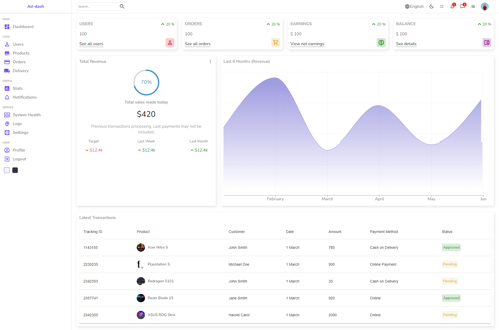
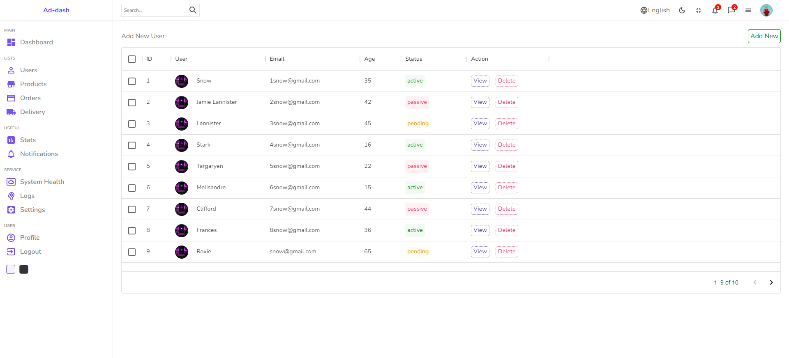
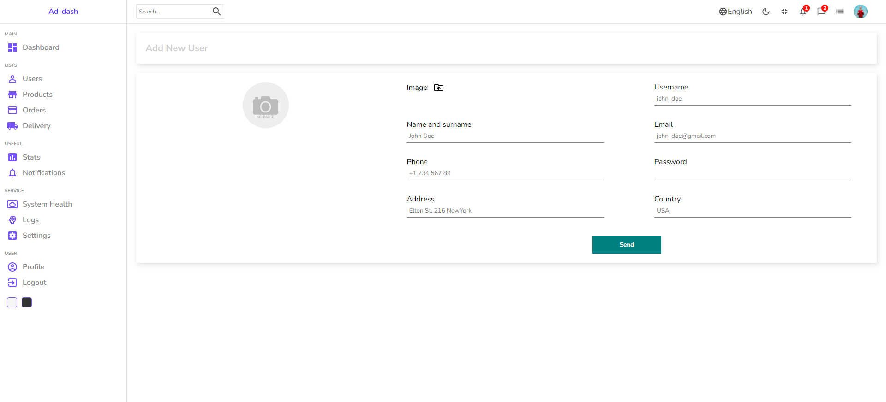

# Important Information

### [Live Site Link](https://admin-dashboard-with-darkmode.netlify.app/) : https://admin-dashboard-with-darkmode.netlify.app/

## Google Font
### Nunito
<link href="https://fonts.googleapis.com/css2?family=Nunito:ital,wght@0,200;0,300;0,400;0,500;0,600;0,700;0,800;0,900;0,1000;1,200;1,300;1,400;1,500;1,600;1,700;1,800;1,900;1,1000&display=swap" rel="stylesheet">

## Packages

### [react-circular-progressbar](https://www.npmjs.com/package/react-circular-progressbar) `npm i react-circular-progressbar`
### [recharts](https://recharts.org/en-US/) `npm install recharts`
### [sass](https://sass-lang.com/) `npm install -g sass`
### [react router dom](https://reactrouter.com/en/main) `npm install react-router-dom`
### [react router dom](https://reactrouter.com/en/main) `npm install react-router-dom`
### [material ui](https://mui.com/material-ui/getting-started/installation/) `npm install @mui/material @emotion/react @emotion/styled`
### [material ui style components](https://mui.com/material-ui/getting-started/installation/) `npm install @mui/material @mui/styled-engine-sc styled-components`
### [material ui icon](https://mui.com/material-ui/getting-started/installation/) `npm install @mui/icons-material`
### [material ui datatable](https://mui.com/material-ui/getting-started/installation/) `npm install @mui/x-data-grid`

## Screenshots

### dashboard

### Users

### add new user

## dark mode screenshot

